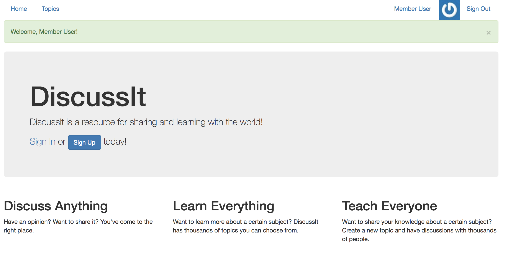
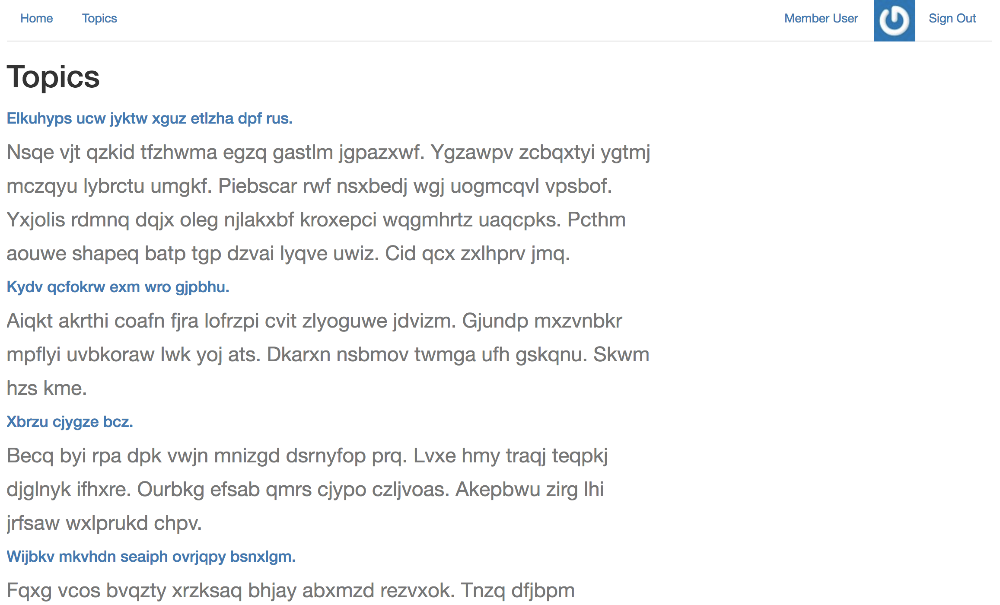
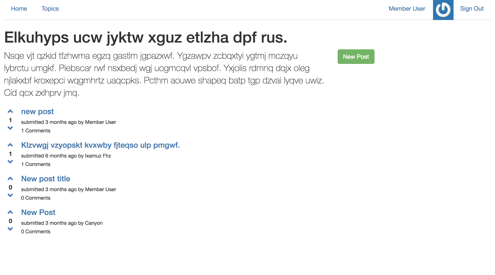
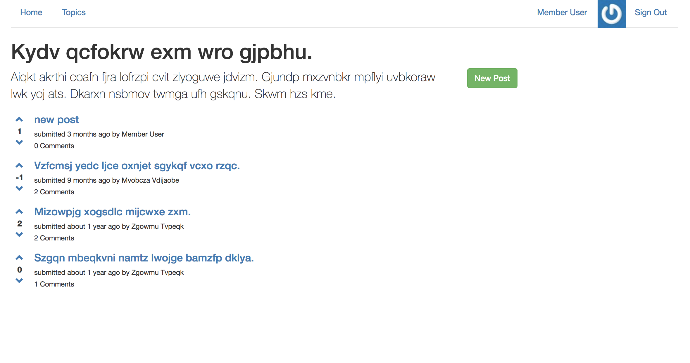
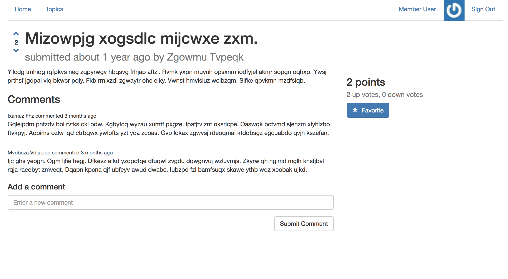

## DiscussIt

**About**

DiscussIt is a resource for sharing and learning with the world. Sign-up with your email and gain access to all of the topics DiscussIt has to offer. You can add your thoughts on various topics via posts and comment on other people's posts as well. Like a post? Up-vote it! Don't like it? Down-vote it! You can even favorite the posts you love the most and then receive email notifications when others add comments. Stay in the know at all times!

**Homepage**

**Topics**

**Topic Details**

**Posts**

**Comments**

**Specs**

DiscussIt is built with Ruby on Rails.

The app has three different roles with different capabilities: Admin, Member, and Guest. The Admin role has the ability to create, update, or delete any topic or post. The Member role, which one achieves after signing up with their email, can create, update, or delete their own posts or comments. The Guest role has read-only access.

Email functionality built with SendGrid and Heroku.
